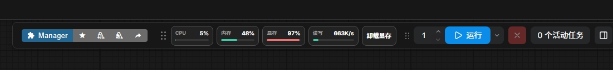
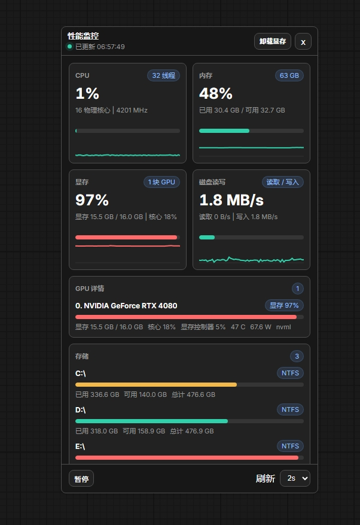

# ComfyUI Performance Monitor

中文 | [English](README_EN.md)

一个用于 ComfyUI 的现代化实时性能监控插件。

## 预览

### 工具栏监控条

紧凑模式会直接显示在 ComfyUI 官方工具栏中，可实时查看 CPU、内存、显存、磁盘读写速度，并提供快速卸载显存按钮。

### 详细信息面板

浮动详细面板提供更大的指标卡片、历史曲线、GPU 详情、存储信息、暂停刷新和刷新间隔控制。

## 功能

- 在 ComfyUI 工具栏中显示紧凑性能监控条。
- 实时显示 CPU、内存、显存、磁盘读取/写入活动。
- 针对 ComfyUI 工作流优先展示显存占用，同时将 GPU 核心使用率作为辅助信息。
- 提供详细浮动面板，包含指标卡片、进度条、历史曲线、GPU 详情和存储信息。
- 提供一键卸载显存按钮，用于快速卸载模型并释放显存。
- 支持将工具栏监控条拖出为浮动组件，也支持通过占位符重新停靠回工具栏。
- 点击紧凑监控条可打开或关闭详细信息面板。
- 支持中文和英文界面文本。
- 跟随 ComfyUI 浅色/深色主题颜色。
